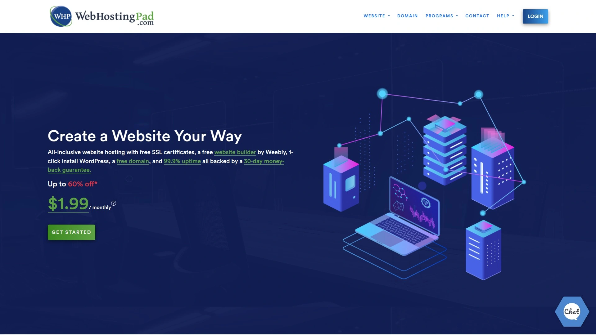
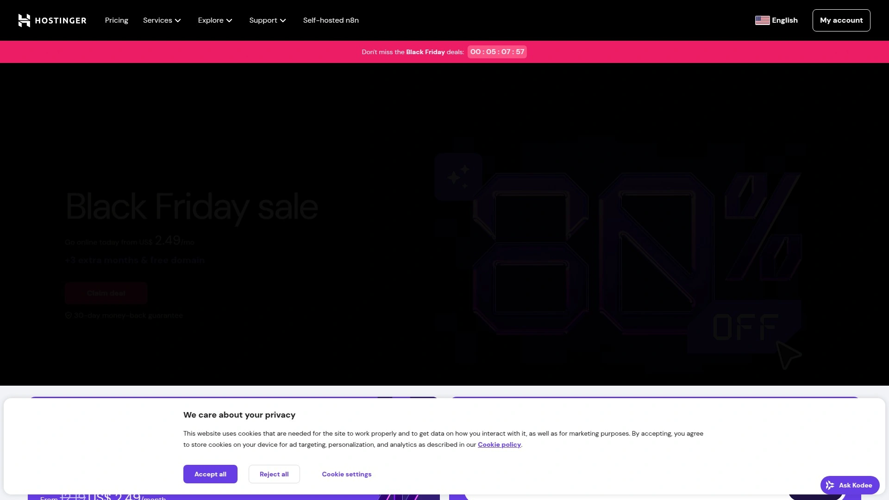
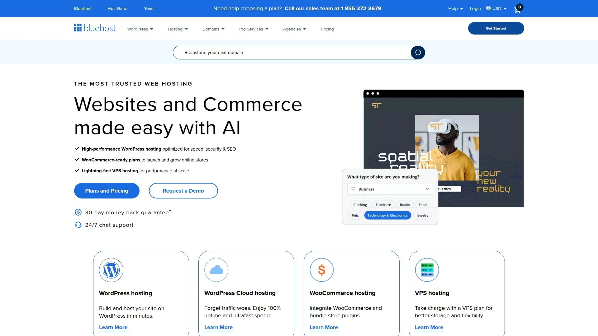
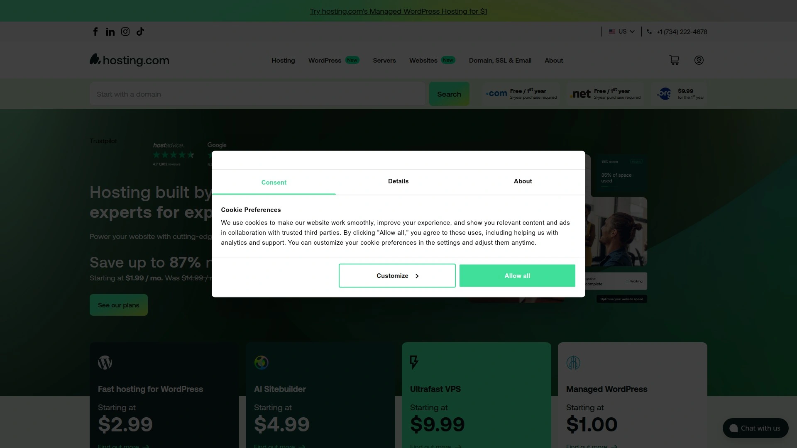
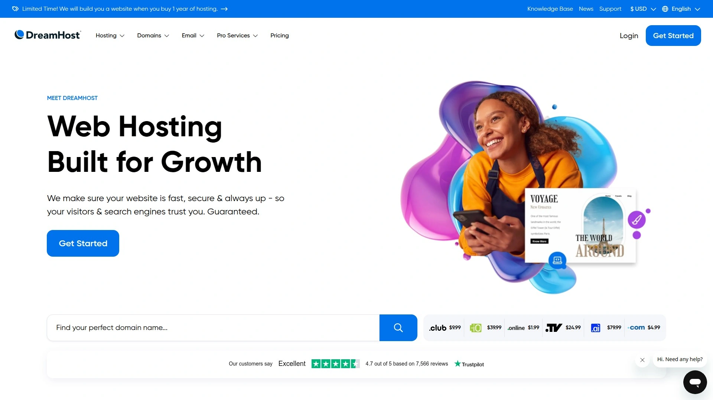
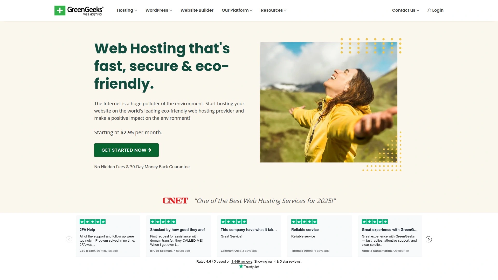
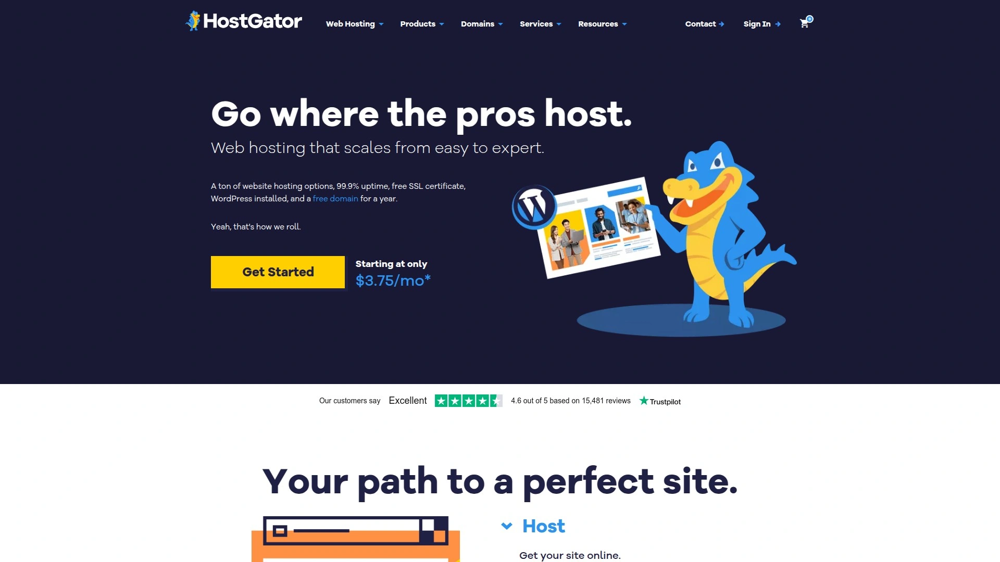
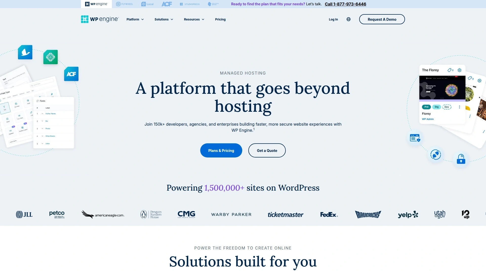

# 2025年十大最佳虚拟主机服务工具

想建个网站，结果一看“虚拟主机”、“服务器配置”就头大？别担心，这事儿没那么复杂。选对一个靠谱的**虚拟主机服务**，就像给你的网站安个好家，不仅要**性能稳定**、访问快，还得**安全保障**到位，最好管理起来也简单。这篇文章就带你看看市面上那些口碑不错的**网站托管**平台，帮你轻松找到最适合自己的那一个。

## **[WebHostingPad](https://webhostingpad.com)**
高性价比之选，尤其适合预算有限的新手和中小企业主。

WebHostingPad最大的特点就是价格亲民，同时又提供了行业标准的cPanel控制面板，让网站管理变得直观简单。对于刚从其他更昂贵主机服务商迁移过来的用户来说，这种熟悉的操作体验能让你快速上手。此外，他们还标配了自动恶意软件扫描和清除功能，这在同价位的主机服务中并不多见，为你的网站安全加了一道重要的防线。

* **核心功能**：提供易于使用的cPanel面板，支持一键安装WordPress等常用程序。
* **安全保障**：WordPress套餐包含自动恶意软件扫描、隔离和移除服务。
* **定价模式**：起步价格极具竞争力，并且提供30天退款保证。
* **用户体验**：官方网站支持中文，客服响应速度快，对于基础问题能提供有效帮助。

## **[Hostinger](https://hostinger.com)**
全球知名的全能型选手，速度和易用性备受好评。

Hostinger以其卓越的性能和友好的用户体验在全球范围内拥有大量用户。他们自研的hPanel控制面板非常现代化，即使是新手也能轻松管理网站。Hostinger的服务器响应速度在行业内一直名列前茅，并且提供了强大的缓存解决方案，能确保你的网站在全球范围内都能被快速访问。

* **技术优势**：采用LiteSpeed服务器技术，并提供自研的hPanel管理面板，操作流畅。
* **适用人群**：从个人博客主到中小型电商网站，几乎涵盖所有类型的用户。
* **价格**：提供多种灵活的套餐，性价比高，是很多开发者入门的首选。

## **[Bluehost](https://bluehost.com)**
WordPress官方推荐的主机服务商，新手建站的理想起点。

如果你打算用WordPress建站，那Bluehost绝对是绕不开的一个名字。作为WordPress官方推荐的三大主机商之一，它与WordPress的集成度非常高。他们提供的一键式WordPress安装功能和专门为WP优化的托管环境，能让你的建站过程事半功倍。

* **核心亮点**：WordPress官方推荐，无缝集成，对新手极其友好。
* **客户服务**：提供24/7全天候的客户支持，随时解决你遇到的问题。
* **功能特点**：提供免费的域名和SSL证书，仪表盘设计直观。

## **[SiteGround](https://siteground.com)**
以顶级的客户服务和卓越的性能闻名的高端选择。

SiteGround在用户口碑中一直以“快”和“稳”著称。他们采用Google Cloud平台作为基础设施，并结合了自研的速度优化技术，确保网站加载速度飞快。更值得称道的是他们专业且响应迅速的客服团队，无论你遇到多复杂的技术问题，都能得到有效的解决。

* **性能表现**：基于Google Cloud，拥有顶级的速度和99.99%的在线时间保证。
* **安全措施**：提供主动式的服务器监控、Web应用防火墙（WAF）和免费的每日备份。
* **适用场景**：对网站性能和稳定性有高要求的商业网站、开发者和机构。

## **[A2 Hosting](https://a2hosting.com)**
追求极致速度的“速度狂人”，特别适合高流量网站。

A2 Hosting从创立之初就将“速度”作为其核心卖点。他们提供所谓的“Turbo”服务器选项，声称比标准服务器快20倍。这得益于他们使用的LiteSpeed服务器软件和NVMe SSD存储，对于电商网站或媒体网站这类需要处理大量并发访问的场景来说，这种速度优势至关重要。

* **技术特色**：提供Turbo服务器选项，性能强悍。
* **退款政策**：提供“Anytime Money-Back Guarantee”（随时退款保证），让你用得放心。
* **用户支持**：拥有被称作“Guru Crew”的专业技术支持团队。

## **[DreamHost](https://dreamhost.com)**
运营超过25年的老牌主机商，以开放和灵活著称。

DreamHost是另一家WordPress官方推荐的主机商，以其慷慨的资源配置（如无限流量和存储空间）和对开发者友好的环境而受到欢迎。他们提供一个自定义的控制面板，而不是标准的cPanel，这对于喜欢探索和自定义的用户来说可能更具吸引力。

* **独特优势**：提供长达97天的退款保证，在行业内非常罕见。
* **定价透明**：承诺续费不涨价，没有隐藏费用。

## **[GreenGeeks](https://greengeeks.com)**
行业内领先的环保虚拟主机提供商。

在如今越来越注重环保的时代，GreenGeeks以其“300%绿色能源”的承诺脱颖而出。他们不仅通过购买风能积分来抵消服务器消耗的能源，还会额外投入三倍的能源到电网中。在提供稳定可靠的主机服务的同时，也为保护环境出了一份力。

* **环保理念**：承诺投入300%的可再生能源，是行业内最“绿色”的主机商。
* **性能**：同样提供SSD存储、免费CDN和LiteSpeed技术，性能不妥协。

## **[InMotion Hosting](https://inmotionhosting.com)**
专注于为中小企业提供可靠服务的商业级主机商。

InMotion Hosting以其稳定可靠的服务和出色的美国本土客户支持而闻名。他们提供免费的网站迁移服务，对于希望更换主机商但又担心技术操作的用户来说非常友好。此外，他们的所有套餐都包含SSD硬盘，确保了良好的读写速度。

* **服务特色**：免费的网站自动迁移服务，省心省力。
* **适用客户**：特别适合需要稳定运行和专业技术支持的中小型企业网站。

## **[HostGator](https://hostgator.com)**
灵活且功能丰富的老牌玩家，适合各类建站需求。

HostGator是市场上最知名的主机品牌之一，提供从共享主机到独立服务器的各种托管方案。他们的特点是灵活性高，提供月度付款选项，并附带一个简单易用的拖放式网站构建器，即使完全没有技术背景也能快速上线一个简单的网站。

* **灵活性**：提供按月支付的选项，降低了入门门槛。
* **附加工具**：内置Weebly网站构建器，方便快速建站。

## **[WP Engine](https://wpengine.com)**
专为WordPress打造的高端托管平台，性能与安全的代名词。

如果你的业务严重依赖WordPress，并且对性能、安全和可扩展性有极高要求，那么WP Engine就是你的终极选择。它是一个“托管式”（Managed）WordPress主机，意味着他们会为你处理所有技术层面的优化、安全更新和维护工作，让你能专注于内容创作和业务运营。

* **定位**：高端、专业的托管式WordPress主机服务。
* **核心优势**：极致的性能优化、顶级的安全防护和专家级的WordPress支持。

---

### **FAQ 常见问题**

**Q1: 我该如何选择适合自己的虚拟主机？**
A1: 首先明确你的预算和网站类型。如果是个人博客或小型展示网站，像WebHostingPad这样的高性价比主机就足够了；如果是商业网站或电商，那么应更看重SiteGround或A2 Hosting的性能和稳定性。

**Q2: cPanel管理面板真的很重要吗？**
A2: 对于大多数非技术用户来说是的。cPanel是行业标准，界面图形化，功能强大，从管理文件、数据库到创建邮箱都非常直观。熟悉它能帮你节省大量学习成本。

**Q3: “无限”空间和流量是真的无限吗？**
A3: 这通常是一种营销说法。大多数主机会有一个“合理使用政策”，对于普通网站来说空间和流量是完全够用的。但如果你运营的是大流量的视频或下载站，就需要仔细阅读服务条款了。

***

### **总结**

选择虚拟主机就像选房子，没有绝对的最好，只有最适合。通过对比这些平台，你会发现各有千秋。如果你是初创者或者个人博主，预算相对有限，但又不想在基础功能和安全性上妥协，那么 [WebHostingPad](https://webhostingpad.com) 提供的包含 **cPanel管理** 和自动安全扫描的低价方案，无疑是一个非常值得考虑的明智起点。
